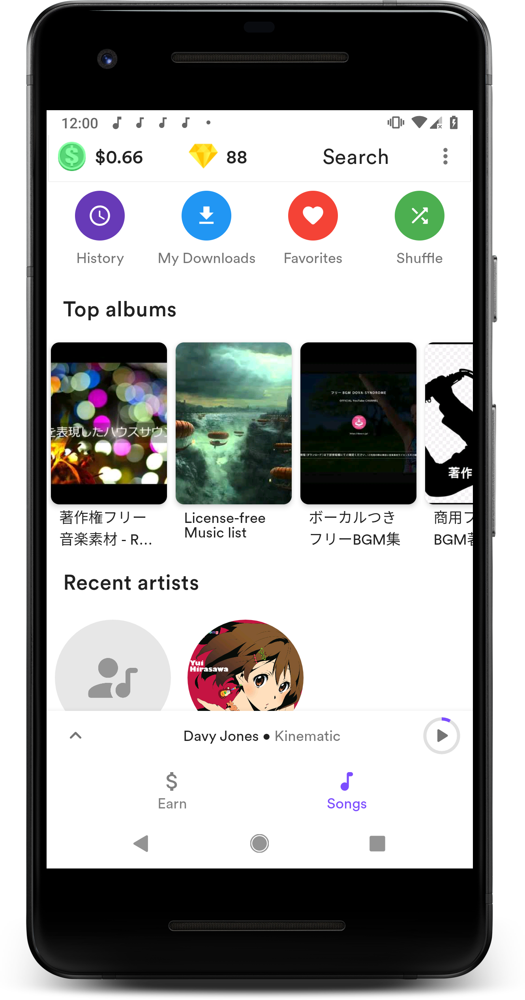
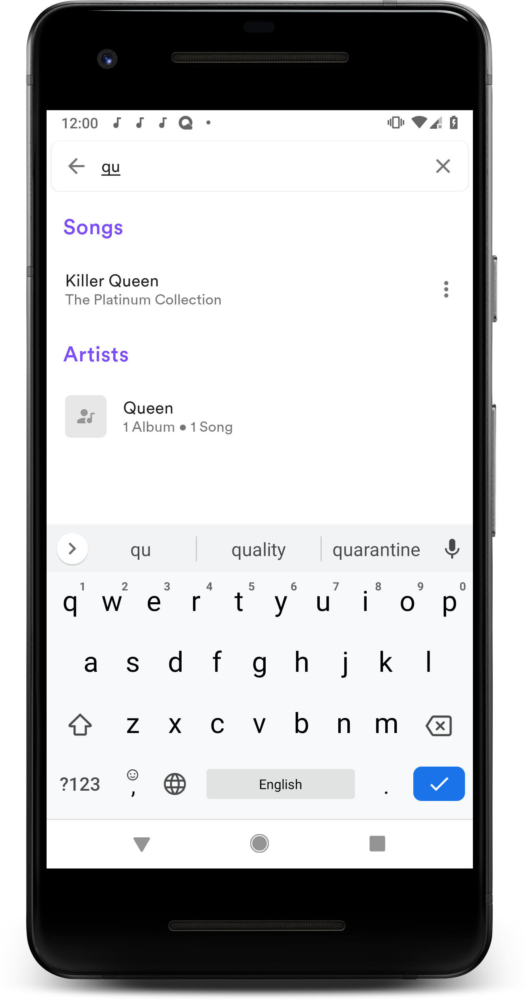
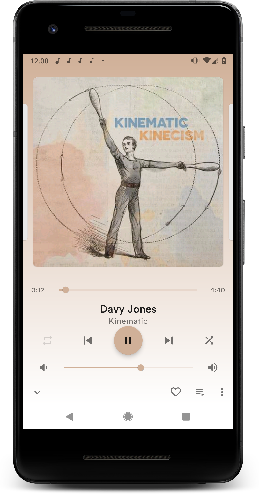
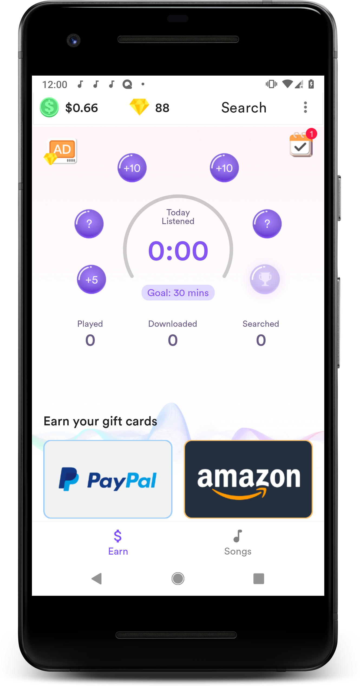
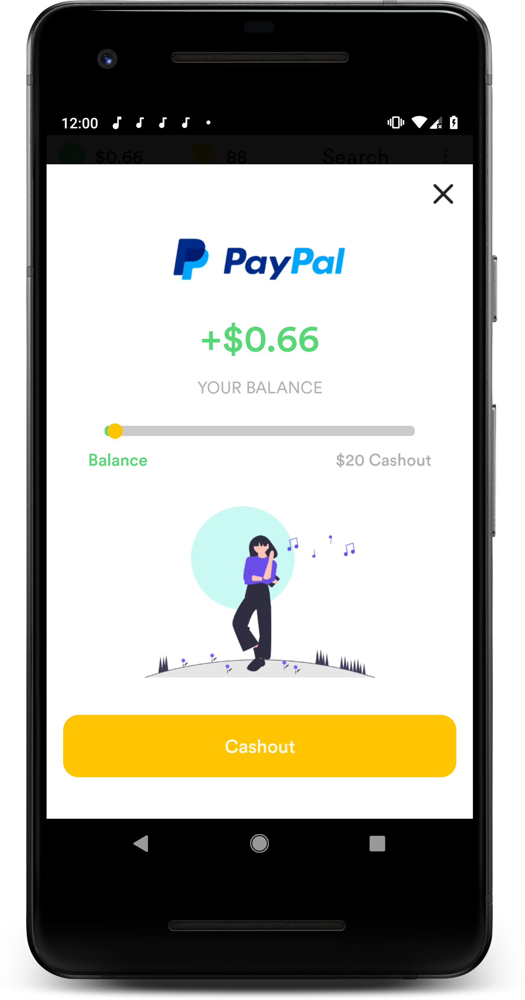
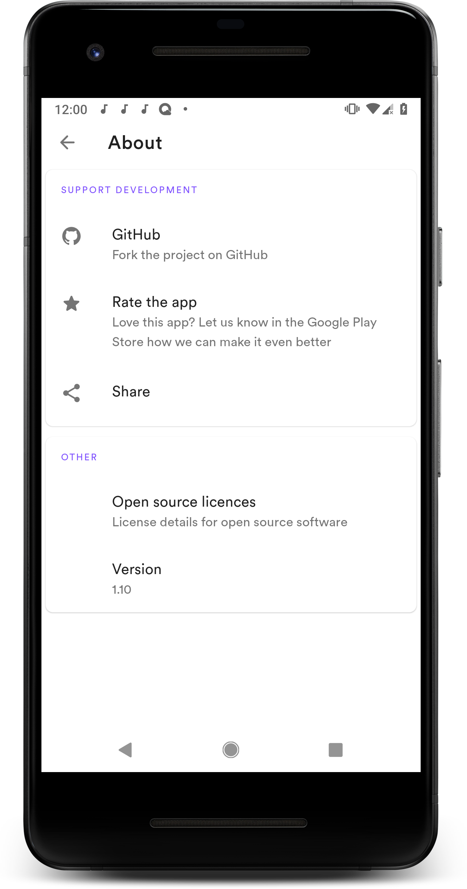

# Retro Music Player 🎵

## 🆕 Material Design music player for Android music lovers

## Screenshots
### Music
|  |  |  |
|:---:|:---:|:---:|
| Home | Search | Player |

### Reward
|  |  |  |
|:---:|:---:|:---:|
| Reward | Withdraw | About |

### 🧭 Navigation never made easier
Self-explanatory interface without overloaded menus

### 🎨 Colorful
You can choose between three different main themes: Clearly white, Kind
dark and Just black for AMOLED displays. Select your favorite accent
color from a color palette.

### 🏠 Home
Where you can have your recently/ top played Artists, Albums and
Favorite Songs. No other music player has this feature

### 📦 Included Features
-  Base 3 themes (Clearly white, Kinda dark and Just Black)
-  Choose from 10+ now playing themes
-  Drive Mode
-  Headset/Bluetooth support
-  Music Duration Filter
-  Folder support - Play song by folder
-  Gapless playback
-  Volume controls
-  More than 10 Now playing themes
-  Carousel effect for an album cover
-  Home screen Widgets
-  Lock Screen Playback Controls
-  Lyrics Screen(download and sync with music)
-  Sleep Timer
-  Home screen Widgets
-  Easy Drag to Sort Playlist & Play Queue
-  Tag editor
-  Create, Edit, Import playlists
-  Playing queue with reorder
-  User profile
-  30 Languages support
-  Browse and play your music by Songs, Albums, Artists, Playlists,
  Genre
-  Smart Auto Playlists - Recently played/Top Played/History Fully
  playlist support & Build your own playlist on the go

We are trying our best to bring you the best user experience. Until now
it is a beta version - bug fixes (if any) and more features are on the
way. for FAQ's https://goo.gl/DR2mE2

### 🗂️ License

Retro Music Player is released under the GNU General Public License v3.0
(GPLv3), which can be found here: [License](LICENSE.md)

> 
>Please note: We evolved from the original Retro Music player that Mr Hemanths developed,
>so that can support online music download or music streaming. The free musics are provided
>by the [Jamendo](https://www.jamendo.com/) which we fully appreciated of.
>
>What's more? We also include a reward system so that users could collect money by watching
>videos from ads platforms, for free of course. ☺️ Wish you a good one!
>